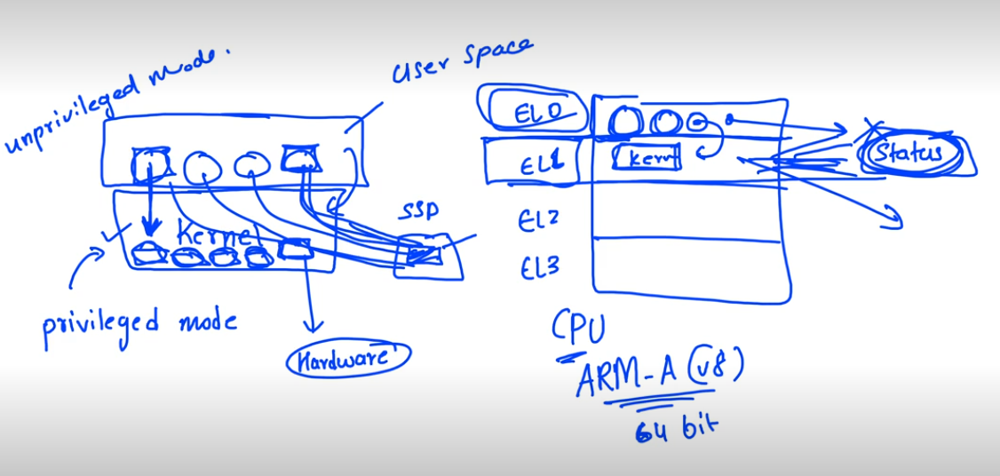
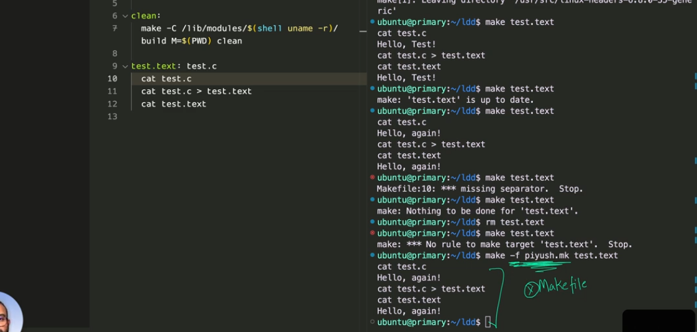
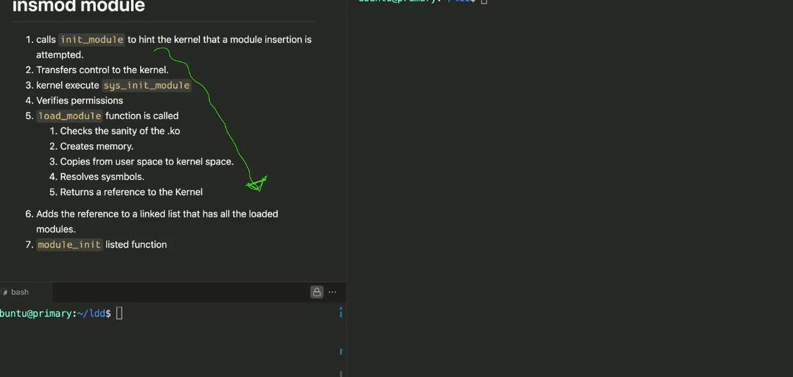
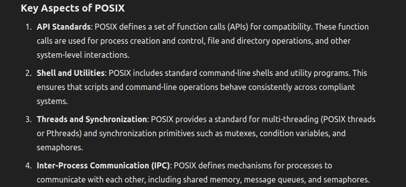

/*Linux notes */

/*ROM BOOTLOADER > SECOND BOOT LOADER (UBOOT) > LOAD KERNEL/DTB IN MEMORY > CPU THEN EXECUTES AND INJECTS DTB IN KERNEL */

/*Kernel operates on privileged mode as it has acess to hw rescourse*/

/*apps run with unprivileged mode*/

# Linux Device Drivers

kernel on armv8 run on el1 , app on el0

from user space to kernel space requests are done by systemcall

system call : bunch of actions  {Generic}

kernel builtin drivers static

### Conceptual Flow Diagram

1. **User Space:**
   * Application → `read(fd, buffer, count)`
2. **System Call:**
   * `read` syscall → Kernel Mode Transition
3. **Kernel Space:**
   * System Call Handler → File Descriptor Lookup
   * File/Device Read Operation → Device Driver Interaction
   * Data Transfer → User Buffer
4. **User Space:**
   * Return Value → Application Receives Data/Error

Device Driver controls ioctl() hardware

 **Interaction Scope** :

* **`/proc`** : Mainly used for simple, informational purposes.
* **`/dev`** : Used for more complex interactions, including control and data management.
* **Operations** :
* **`/proc`** : Generally supports only basic read and write operations.
* **`/dev`** : Supports a broader range of operations, including custom control commands and advanced features like `mmap` and `poll`.
* **Driver Features** :
* **`/proc`** : Suitable for providing configuration and status information with minimal driver functionality.
* **`/dev`** : Suitable for implementing full driver functionality with advanced features.

read(): copy_to_user() send read buffer to user in userspace

write():copy_from_user()/sprintf  copy data from user to kernel

